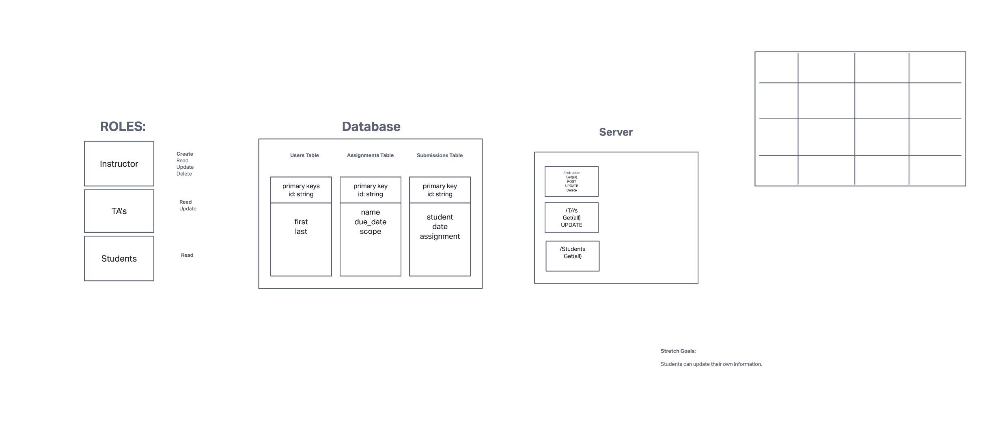

# Lab 09 CMS - Auth Module Final Project

## Challenge

Create a new application using your API Server and Authentication System learnings.

Your team will be responsible for planning, executing, and presenting an application that showcases a Content Management System (CMS) using full RESTful CRUD operations.

Team Agreement:

* Open communication

* We resolve issues by bringing them up right away and working towards solutions.

* Pair programming will have us working side by side and will be able to talk through the concept and work.

